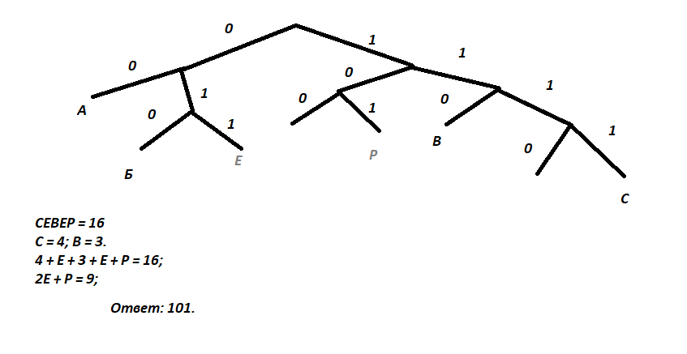

Все заглавные буквы русского алфавита закодированы неравномерным
двоичным кодом, в котором никакое кодовое слово не является началом
другого кодового слова. Это условие обеспечивает возможность однозначной
расшифровки закодированных сообщений. Известны кодовые слова
некоторых букв: А – 00, Б – 010, В – 110, С – 1111. Известно также, что код
слова СЕВЕР содержит 16 двоичных знаков. Укажите самый короткий
возможный код буквы Р. Если таких кодов несколько, укажите тот из них,
который имеет наибольшее числовое значение.

#### Решение #1

**Ответ:** 101.
